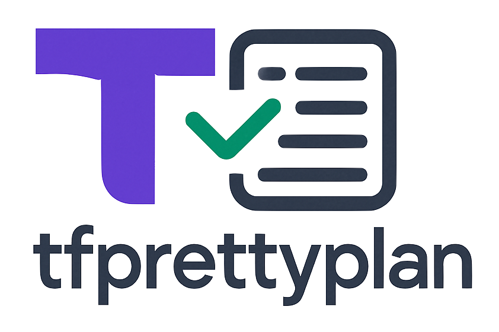

<div align="center">

<p>CLI tool that formats Terraform plans into clean, readable tables.</p>
</div>

## Features

- Parses Terraform plan JSON files
- Displays a summary of resources to be created, updated, or deleted
- Shows detailed information about each resource change
- Highlights changes with color (can be disabled)
- Supports reading from files or standard input
- Enhanced table formatting with dynamic column sizing
- Smart truncation for long values that preserves important parts
- Multiple output width options to accommodate different content lengths
- Automatic terminal width detection for optimal display

## Installation

### Install via Script (Recommended)

Run this one-liner to install the latest version for your OS and architecture:

```bash
curl -s https://raw.githubusercontent.com/ao/tfprettyplan/main/install.sh | bash
```

This script:

- Detects your OS and CPU
- Fetches the latest release from GitHub
- Installs tfprettyplan into /usr/local/bin

You can inspect the script [here](https://github.com/ao/tfprettyplan/blob/main/install.sh).

For Windows, download the ZIP file from the releases page and extract it to a location in your PATH.

### Using Go

If you have Go installed, you can install TFPrettyPlan directly:

```bash
go install github.com/ao/tfprettyplan/cmd/tfprettyplan@latest
```

### From Source

```bash
git clone https://github.com/ao/tfprettyplan.git
cd tfprettyplan
go build -o tfprettyplan ./cmd/tfprettyplan
```

## Usage

TFPrettyPlan can read Terraform plan files in JSON format. You can provide the plan file as an argument or pipe the JSON data to the tool.

### Basic Usage

```bash
# Read from a file
tfprettyplan plan.json

# Using the -file flag
tfprettyplan -file plan.json

# Pipe from terraform show
terraform show -json plan.tfplan | tfprettyplan
```

### Formatting Options

```bash
# Use wider output format for better readability
tfprettyplan -wide plan.json

# Set a specific terminal width
tfprettyplan -width 120 plan.json

# Disable automatic width detection
tfprettyplan -no-auto-width plan.json

# Combine options as needed
tfprettyplan -wide -no-color plan.json
```

### Flags

- `-file, -f`: Path to Terraform plan JSON file
- `-no-color`: Disable color output
- `-version, -v`: Show version information
- `-wide`, `-w`: Use wider output format for better readability of long values
- `-width`: Set a fixed terminal width (overrides auto-detection)
- `-no-auto-width`: Disable automatic terminal width detection

## Example

To use TFPrettyPlan with a Terraform plan:

1. Generate a Terraform plan file:

   ```bash
   terraform plan -out=plan.tfplan
   ```

2. Convert the plan to JSON:

   ```bash
   terraform show -json plan.tfplan > plan.json
   ```

3. Use TFPrettyPlan to visualize the plan:

   ```bash
   tfprettyplan plan.json
   ```

   Or in a single command:

   ```bash
   terraform show -json plan.tfplan | tfprettyplan
   ```

## Sample Output

```
Terraform Plan Summary
=====================

+--------+-------+
| ACTION | COUNT |
+--------+-------+
| Create |     2 |
| Update |     1 |
| Delete |     1 |
| Total  |     4 |
+--------+-------+

Resources to Create
==================

• aws_instance.example (aws_instance)

• aws_security_group.allow_ssh (aws_security_group)

Resources to Update
==================

• aws_s3_bucket.logs (aws_s3_bucket)
  +---------------+------------------+------------------+
  |   ATTRIBUTE   |    OLD VALUE     |    NEW VALUE     |
  +---------------+------------------+------------------+
  | acl           | private          | public-read      |
  | force_destroy | false            | true             |
  | tags.Name     | Log Bucket       | Logs Bucket      |
  +---------------+------------------+------------------+

Resources to Delete
==================

• aws_iam_role.lambda (aws_iam_role)
```

## Table Formatting Examples

### Standard Format (Default)

```
• aws_s3_bucket.logs (aws_s3_bucket)
  +---------------+------------------+------------------+
  |   ATTRIBUTE   |    OLD VALUE     |    NEW VALUE     |
  +---------------+------------------+------------------+
  | acl           | private          | public-read      |
  | force_destroy | false            | true             |
  | tags.Name     | Log Bucket       | Logs Bucket      |
  +---------------+------------------+------------------+
```

### Wide Format (-wide)

```
• aws_s3_bucket.logs (aws_s3_bucket)
  +---------------+--------------------------------+--------------------------------+
  |   ATTRIBUTE   |            OLD VALUE           |            NEW VALUE           |
  +---------------+--------------------------------+--------------------------------+
  | acl           | private                        | public-read                    |
  | force_destroy | false                          | true                           |
  | tags.Name     | Log Bucket with a longer name  | Logs Bucket with details       |
  | description   | This is a short description... | This is a longer description...|
  +---------------+--------------------------------+--------------------------------+
```

### Smart Truncation

For long values, TFPrettyPlan uses smart truncation to preserve important parts:

- **Path-like strings**: Preserves beginning and end parts
  ```
  /very/long/path/with/many/nested/directories/file.txt → /very/long/.../file.txt
  ```

- **JSON-like values**: Preserves structure
  ```
  {"key":"value","nested":{"prop":"too long to display fully"}} → {"key":"value","nested":{"prop":"too...}}
  ```

- **Long strings**: Truncates middle
  ```
  This is a very long string that exceeds the column width → This is a...column width
  ```

## Releases and Versioning

TFPrettyPlan uses semantic versioning and automated releases:

- New releases are automatically created when code is pushed to the main branch
- Releases follow semantic versioning (MAJOR.MINOR.PATCH)
- Each release includes pre-built binaries for all supported platforms
- Release notes are automatically generated from commit messages

You can find all releases on the [GitHub Releases page](https://github.com/ao/tfprettyplan/releases).

## Testing

TFPrettyPlan includes a comprehensive test suite to ensure the reliability and correctness of its functionality.

### Running Tests

To run the tests, use the standard Go testing tools:

```bash
# Run all tests
go test ./...

# Run tests for a specific package
go test ./pkg/parser
go test ./pkg/renderer
go test ./pkg/config
go test ./pkg/terminal

# Run tests with verbose output
go test -v ./...

# Run tests with coverage report
go test -cover ./...

# Generate a detailed HTML coverage report
go test -coverprofile=coverage.out ./...
go tool cover -html=coverage.out -o coverage.html
```

### Writing Tests

If you're contributing to TFPrettyPlan, please ensure that your changes are covered by tests. Each package has its own test file(s) that follow Go's standard testing conventions.

Test files are named with the `_test.go` suffix and are located in the same directory as the code they test.

## Contributing

Contributions are welcome! Please feel free to submit a Pull Request.

For commit messages, we follow [Conventional Commits](https://www.conventionalcommits.org/) format:

```
feat: add new feature
fix: fix a bug
docs: update documentation
refactor: code refactoring without functionality changes
```

This helps with automatic versioning and changelog generation.

### Development Workflow

1. Fork the repository
2. Create a new branch for your feature or bug fix
3. Write tests for your changes
4. Implement your changes
5. Ensure all tests pass
6. Submit a pull request

## License

This project is licensed under the MIT License - see the LICENSE file for details.
